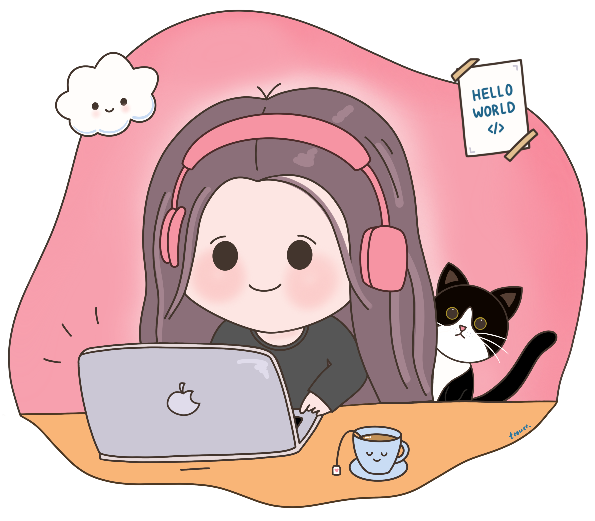

  <h1>Hi, I'm Tuyet! 👋 </h1>
  
  
  <b> Software Engineer </b>
   
  I enjoy putting together technical solutions to vague problems.

### 💻 Current Tech Stack
**Languages:** Python, JavaScript  
**Backend development:** FastAPI  
**Frontend development:** HTML, CSS, Sass  
**Cloud services:** AWS (S3, IAM, SNS, SQS, Lambda, API Gateway, DynamoDB)  
**Open-source tools:** Docker, Kubernetes  
**CI/CD:** Github Actions, Jenkins, Spinnaker  
**Observability:** Datadog, Splunk  
**Event streaming:** Apache Kafka  
**Big Data:** Tableau, Hue, Hive, Qubole
